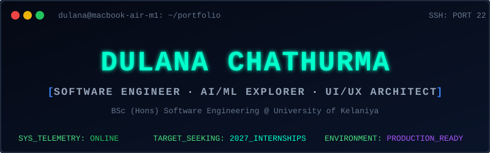

<!-- 🌟 HEADER SECTION (Auto-running Terminal SVG) 🌟 -->

  

  

 

<!-- 👨‍💻 INTRO & ANIMATION SECTION -->

  <table>
    <tr>
      <td align="center" width="30%">
        
      </td>
      <td align="left" width="40%">
        <h2>Hi there! 👋 I'm Dulana</h2>
        
I blend <b>logical problem-solving</b> with <b>aesthetic UI/UX</b> to build robust software systems. Currently mastering Full-Stack Development while diving deep into the world of AI/ML.

        
🎓 <b>Undergrad:</b> University of Kelaniya '29 
        🎯 <b>Goal:</b> 2027 SE / AI-ML Internship 
        💡 <b>Philosophy:</b> "Code is poetry, logic is art."

      </td>
      <td align="center" width="30%">
        
      </td>
    </tr>
  </table>

<!-- 🌐 SOCIAL CONNECT -->

  
  
  
  
  

 

<!-- 🚀 TECH ARSENAL (MODERN SKILL ICONS) -->
<h2 align="center">⚡ My Tech Arsenal</h2>

  <a href="https://skillicons.dev">
      
      
    
  </a>

 

<!-- 🏗️ FEATURED PROJECTS (BENTO BOX GRID UI) -->
<h2 align="center">🔥 Featured Engineering Projects</h2>

  <table>
    <tr>
      <td width="50%" align="center">
        <h3 align="center">👁️‍🗨️ VisionScope AI</h3>
        
<i>Computer Vision & Feature Detection</i>

        
      </td>
      <td width="50%" align="center">
        <h3 align="center">📝 NexaTask</h3>
        
<i>Full-Stack MERN Application</i>

        
      </td>
    </tr>
    <tr>
      <td width="50%" align="center">
        <h3 align="center">🖥️ Custom OS (SENG)</h3>
        
<i>Low-Level C & Assembly Operating System</i>

        
      </td>
      <td width="50%" align="center">
        <h3 align="center">✨ SriSeta Platform</h3>
        
<i>Modern React & Tailwind UI Web Platform</i>

        
      </td>
    </tr>
  </table>

 

--
## 📊 GitHub Analytics

  
    
  
    
  <!-- Updated Green Neon Streak Stats matching the screenshot -->
  

<!-- 🏆 TROPHIES & WAKATIME -->
 

  

 

  

<!-- 🐍 CONTRIBUTION SNAKE -->
<h2 align="center">🌌 Contribution Galaxy (Snake)</h2>

  <picture>
    <source media="(prefers-color-scheme: dark)" srcset="https://raw.githubusercontent.com/dulanachathurma/dulanachathurma/output/github-contribution-grid-snake-dark.svg">
    <source media="(prefers-color-scheme: light)" srcset="https://raw.githubusercontent.com/dulanachathurma/dulanachathurma/output/github-contribution-grid-snake.svg">
    
  </picture>

 

<!-- 🌟 FOOTER -->

  <i>"First, solve the problem. Then, write the code." – John Johnson</i>
    
  

